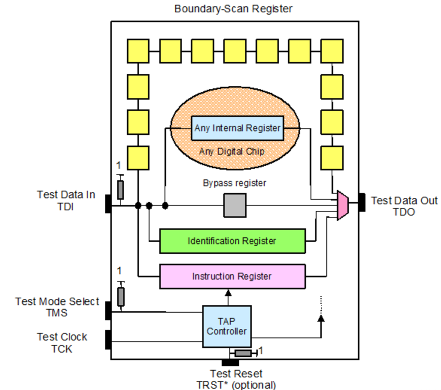
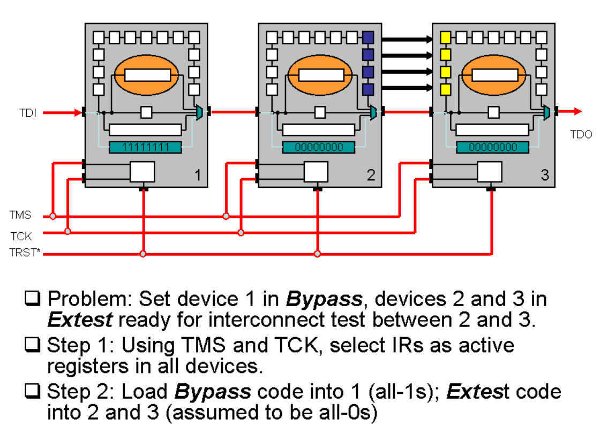

[https://blog.csdn.net/bukong123/article/details/134231895](https://blog.csdn.net/bukong123/article/details/134231895)

> 这里的JTAG是指符合**IEEE 1149.1 JTAG**的标准接口, 而非调试器

## JTAG标注架构

先来看看JTAG的Architecture digram

有四个接口pin:

* TDI
* TDO
* TMS
* TCK

TCK就是时钟, TMS是测试模式选择, TDI/TDO分别是数据的in/out

这样看, 是不是和SPI挺像的, 其实区别很大!

为什么呢, 这个要从用途讲起, JTAG是一种调试接口, 我的芯片可能要去封装多个die, 或者有连接多个芯片调试的需求, 但是一般只会有一个JTAG口, 这怎么办呢?

在SPI中, 我可以通过 `CS`来选中某个设备, 如果有两个设备, 那就CS0/CS1, 但如果有100个设备呢。。。

在JTAG中有另外一种更节省管脚的实现方式, 在某一个device的数据包会直接发给下一个, 下一个拼接完再发给下下一个, 连接方式的话就是 `TDO`连接下一个JTAG设备的 `TDI`, 依次成链, 可以参考下图

其实这种思想在片内总线中也有应用, 例如片内的环形总线。

## 硬件连接

就可以指导我们硬件连接了, `TMS`/`TCK` 这些信号按照菊花链的形式连接到所有device的JTAG, `TDO`和 `TDI`就按照首尾相接进行互联。

## ZYNQ中的JTAG

ZYNQ里面包括PS和PL两部分, 二者都是有JTAG接口的。

在官方的手册中, 可以看到, 我们可以配置ZYNQ为两种模式:

* 独立模式(Independent)
* 级联模式(Cascade)

独立模式就是这两各占一个JTAG接口, 在ARM端这个接口叫做DAP, 在PL端这个叫做TAP

级联模式就是将两者在内部连接在一起, 只暴露出一个接口。但是我们能扫到两个设备!

## JTAG调试器

JTAG调试器里装的是什么, 起什么作用, 价格差很多的两个调试器有什么区别, 为什么有的里面是一个FPGA?

其实根据上文, 已经能大概猜出JTAG调试器里的是什么了。

JTAG调试器要实现的功能就是一个JTAG的控制器, 如果JTAG Device是Slave, 那么JTAG盒子就是Master。

一般里面是一个ASIC芯片, 但是用FPGA也能实现。
