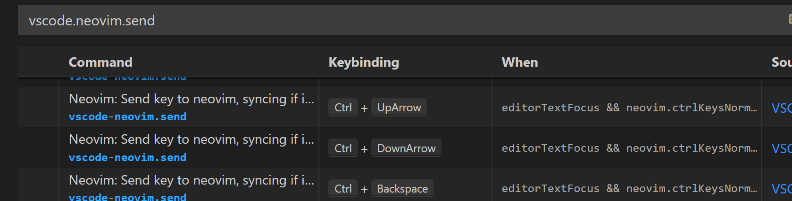

## NeoVim 是什么

折腾编辑器是年轻人爱干的事, 年纪大了还是选择开箱即用的, 虽然VScode很好用, 但是ssh远程登录不可能每个主机都装VScode, 一般都是用VIM。

NeoVim是Vim的一个Fork, 旨在提供更好用, 更美观, 更据扩展性的vim。并且, 最重要的是!!! NeoVim是一个简单配置就很**好用**的**轻量**编辑器!!!

NeoVim的Github, 可以 `apt install neovim`来安装



## NeoVim的美化

NeoVim刚安装完还不好用, 还需要必要的配置, 本着不折腾的原则, 我们可以直接用LazyVim，这又是一个高Star的项目, 极力推荐。^_^



直接clone 到Home路径, 然后执行nvim就可以自动完成配置了

```shell
git clone https://github.com/LazyVim/starter ~/.config/nvim
```


**Optional!** NeoVide是可选的!


如果你想要使用GUI来实现非常炫酷的跳转效果, 那么你可能需要这个 [NeoVide](https://neovide.dev), 这个显示效果真的会让你coding时心情倍儿爽, 效率翻倍。而且, 这个GUI是 `Rust`来实现的, 非常高效, 并不怎么吃配置



## 配置和安装插件

### 安装nerd字体

这样可以显示一些特殊字符, 可以从[这个网站](https://www.nerdfonts.com/font-downloads)下载, 这里推荐 `MesloLG`

### 配置lua环境

想要配置和安装插件, 一般需要有一个lua的编译器

首先需要下载luajit, 目前最新的版本是v2.1

```
git clone https://luajit.org/git/luajit.git
```

然后cd到luajit目录, 可以看到有一个Makefile, 直接执行 `make`


然后输入 `make install`安装, install步骤需要sudo权限, 会安装到/usr/local/bin目录


### 安装必要组件

为了更丝滑的使用NeoVim, 可以安装这些包:

```
sudo apt -y install ripgrap fg-find nodejs npm erlang
```

## 在Windows下使用

### VScode + NeoVim = 好用的IDE

VScode很好用, 但还是那个问题, 和Vim操作逻辑不一样, vscode中有个VIM插件, 但是bug很多。本人重度使用VScode, 安装了非常多的插件, 更换一个新的编辑器成本很高, 直到我发现了这个插件 [Neovim](https://neovim.io/) , 完美解决了我的所有问题。你可以继续使用你的Code插件, 并且在insert模式下, code的一些操作是几乎一样的。




### 安装和配置

安装很简单, 在code中搜索neovim插件安装即可

当然前提是你已经安装了 `neovim`, 如果是Windows, 可能还需要装一个GCC来编译, 可以通过[Msys2 ](https://www.msys2.org/)安装 `MinWG`, 或者装一个 `LLVM  `, 这里不细讲了

配置阶段, NeoVim插件调用了LazyVim插件, 不同的是, 很多快捷键是不相同的。

不过不要担心, 如果熟悉Vim, 基本可以无缝兼容Vim和VScode

当然有一些快捷键是冲突的, 具体可以在 `keyboard`的 `vscode.neovim.send`中查看



如果想找Neovim的快捷键怎么办呢?

LazyVim输入命令时会有提示, 但在VScode中是没有的, 可以直接通过输入 `:help` 来查看


厉害的是, Explorer中也是可以使用Vim快捷键的, 这里列出一些常用的快捷键:

| 快捷键      | 作用         |
| ----------- | ------------ |
| `j`       | 向下滚动一行 |
| `k`       | 向上滚动一行 |
| `z` `c` | 折叠当前层级 |
| `z` `m` | 折叠全部     |
| `/`       | 开始搜索     |

文件操作

| 快捷键 | 作用       |
| ------ | ---------- |
| `r`  | 重命名     |
| `x`  | 剪切       |
| `y`  | 复制       |
| `p`  | 粘贴       |
| `a`  | 创建文件   |
| `A`  | 创建文件夹 |
| `d`  | 删除       |

窗口快捷键

| 快捷键  | 作用                         |
| ------- | ---------------------------- |
| :vnew   | 新建窗口                     |
| ctrl +` | 打开termianl, 这是code原来的 |
| ctrl+h  | 左边窗口                     |
| ctrl+j  | 下边窗口                     |
| `a`   | 创建文件                     |
| `A`   | 创建文件夹                   |
| `d`   | 删除                         |
| `v`   | 分屏显示                     |

Enjoy!

## Android安装NeoVim

是的, Android上也是可以装的。

首先, 需要装一个Termux, 不过刚装上可能体验不好, 机输入本来就很难受, 而且界面很丑, 简直是双重暴击! 我们首先要美化Termux, 这个已经有大神出过详细的教程, 可以参考这里: [Termux 高级终端安装使用配置教程](https://www.sqlsec.com/2018/05/termux.html)

当你有了Termux这个终端, 直接运行下面命令就可以了:

```shell
pkg install neovim
```


**Info!** pkg是一个Termux的包管理工具, install 时会自动update, 当然Termux也支持apt等包管理工具


同样的, clone一个lazyvim, 就可以愉快的在安卓上使用nvim啦!
