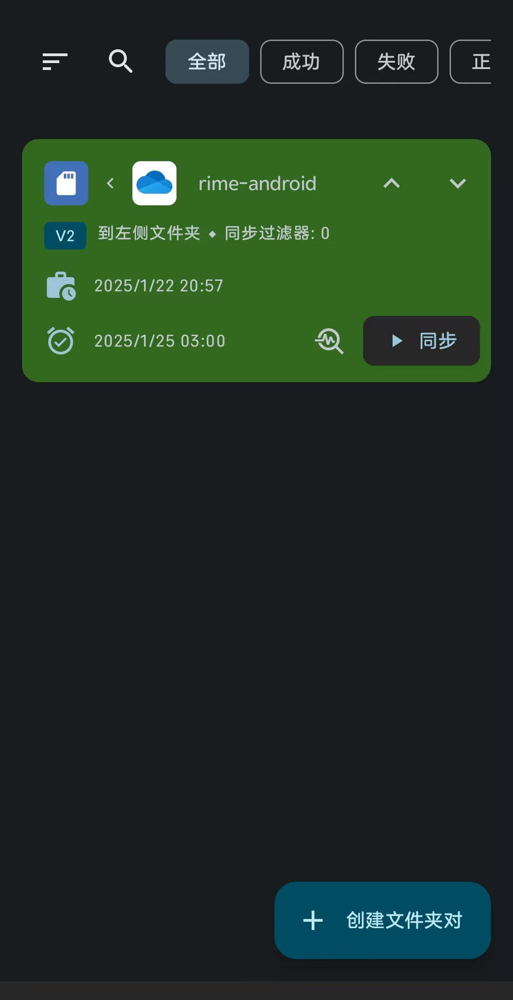

# 为什么要折腾Rime

现在流行的输入法软件有搜狗、百度、微信、微软输入法等，但是这些输入法都有我不满意的地方。

搜狗和百度输入法过于臃肿，附带了太多和输入无关的功能，不能导出明文词库，联网上传用户信息，我并不想要这样的功能，不想我输入的内容被他人查看。微信输入法的词库和配置保存在本地系统，但是没有提供备份词库的方式。微软输入法使用起来非常别扭，比如不支持tab翻页，好多词语和句子不能一次输出，总是要选字，而且我不适应它的内嵌编辑模式（单行模式）。

我觉得输入法最大的资产就是自己日积月累的词库，而绝大多数输入法不提供个人词库导出明文词库的方式，大部分的仅提供加密词库导出，个别的不提供词库导出，这给用户迁移输入法软件制造了障碍。如果输入法提供明文文本的个人词库，即使格式不一样，也可以编辑变成需要的格式。

选择什么样的输入法?

我试用了不少输入法软件，发现一款开源的输入法基本满足了我的要求。它就是中州韵输入法，又叫RIME。RIME是一个免费开源的输入法引擎，小狼毫输入法是RIME输入法在Windows上的名称。它安装包很小，功能强大，可定制性高，不管是软件界面还是输入方案都能随心所欲地实现个性化功能。它不会主动上传你的个人词库到网络，又提供明文词库的备份方式。它可以简单到极致，只关注打字，也可以打扮地花里胡哨，添加各种功能。


# 在Windows上部署

在windows上算是最简单的了, 我们先从简单的开始!

首先, 下载一个Rime, 点击[这里](https://rime.im), 在windows上叫做Weasel

安装后, 先不要使用, 因为词库和配置都是不全的, 自己折腾费时费力, 我们可以要下载一个 `白霜词库(基于雾凇词库),` 会变得so easy。

白霜词库的[github链接](https://github.com/gaboolic/rime-frost), 这里的release包有字库和配置, 稍微改改就可以使用了, 里面有基本说明, 我就不赘述了。

`git clone --depth 1 https://github.com/gaboolic/rime-frost Rime`

现在就可以直接用了, 但是我们可以稍微改点东西:

## 修改全角标点

全角标点在编程时体验极差, 尤其是全角的 `逗号, 冒号`, 长得完全一样, 句号反而能一眼看出来区别。我们可以自动已一下, 这也是Rime灵活的地方:

打开 user floder中的 `default.yaml` , 做如下修改。

```
  half_shape:
    ',' : ','
    '.' : '。'
    '<' : '《'
    '>' : '》'
    '/' : [ /, ÷ ]
    '?' : '?'
    ';' : ';'
    ':' : ':'
```

## 添加常用于

可以打开 custom_phrase.txt, 添加即可。 例如我想要输入"手机shouji", 显示手机号

`13811381138	shouji`

## Lua脚本实现一些复杂功能

`白霜词库`中包含了一些Lua脚本, key开箱即用。

这里抛砖引玉, 例如我想要输入 "week" 时显示这周是从几号到几号, 效果如下图, 要如何实现呢?


在 `rime_frost.schema.yaml`中, 添加需要触发的关键字

```
date_translator:
  week: week     # 星期自定义脚本
```

然后打开所对应的lua脚本, 我这里对应到 `date_translate.lua`, 添加下面函数

```lua
function M.func(input, seg, env)
    if (input == M.week) then
        local current_time = os.time()
        local week_tab = {'日', '一', '二', '三', '四', '五', '六'}
        local text = week_tab[tonumber(os.date('%w', current_time) + 1)]
        local CurrWeekMonday = os.date("%m.%d", os.time({
            year = os.date("%Y"),
            month = os.date("%m"),
            day = os.date("%d") - os.date("%w") + 1
        }))
        local CurrWeekFriday = os.date("%m.%d", os.time({
            year = os.date("%Y"),
            month = os.date("%m"),
            day = os.date("%d") - os.date("%w") + 5
        }))
        yield_cand(seg, os.date("第%W周", current_time) .. '(' .. CurrWeekMonday .. '-' .. CurrWeekFriday .. ')')

```

## 在不同程序中输入法的默认状态

这个有什么用呢, 例如我打开一个terminal, 我肯定是要输入英文, 这个可以实现吗?

当然!!!

只需要在 `weasel.yaml`中添加:

```yaml
# [app_options]
# 针对特定应用的设置
app_options:
  cmd.exe:               # 带 .exe 的进程名：Weasel 15.0 及之前版本须小写; PR #1049 合并后释出的版本大小写不敏感
    ascii_mode: true     # 英文模式
  windowsterminal.exe:
    ascii_mode: true
  wt.exe:
    ascii_mode: true
  powershell.exe:
    ascii_mode: true
  git-bash.exe:
    ascii_mode: true
```

## 同步

Rime身为全平台的输入法, 而且注重隐私的输入法, 是没办法自动同步的! 为了安全牺牲点便利也可以理解, 自己同步也很简单!

只需要改一个文件 `installation.yaml`, 添加这两行, 这里我用 `onedriver`实现同步, 在 `onedriver`中新建一个 `RimeSync`文件夹

```yaml
installation_id: LNmint_labtop
sync_dir: "C:\\Users\\LNmint\\OneDrive\\AppData\\RimeSync"
```

这样就可以愉快打字啦, 其他的功能请自行琢磨

# 安卓

Android比较麻烦, 一个是没有特别好用的输入App, 再一个由于 `Android 11`之后对App用户权限的管理, 导致文件读写非常麻烦。但不要紧, 我们不需要root也可以, 直接开始!!!

输入App, 这里我选择 `小企鹅输入法for android`, 各大应用市场都可以下载。

然后打开小企鹅, 在里面安装一个rime插件。

接下来关键的来了, 如果不root, `Android/Data`  这个目录是第三方应用访问不了的, 很多文件管理器也不行, 读都不行! 但是MT文件管理器可以。

我们将Windows里生成的一整套 `白霜词库`方案, 拷贝到 `data/rime`

## 安卓同步

这个比较麻烦, 我们需要用小企鹅打开用户文件夹, 必需用小企鹅, 进入到 `data/rime` 文件夹, 然后编辑一下 `installation.yaml` 将路径改为我们有权限读写的, 这一步非常关键! 例如:

`sync_dir: "/storage/emulated/0/Documents/RimeSync"`

打开小企鹅, 切换到Rime输入方案, 然后点击同步, 这样你会发现一些文件会放到上面写的路径里。

然后我们下载一个 `FolderSync`, 然后增加同步方案为 上述路径和Onedriver之间进行同步。这样就畅通无阻啦!



`FolderSync`可以添加自动定期同步计划, 这样完全解放双手了。

打开小企鹅, 点击 `同步`和 `重新部署`, 电脑和手机的配置和词库就全部同步了。

# Linux篇

Linux这里和Windows差不多, 主要区别是有两种输入方案: `Ibus`和 `fcitx5`, 这里我选择前者。

以 `Debian`为例, apt安装 `ibus-rime`, 可点击[这里](https://github.com/rime/ibus-rime)

其他和Windows差不多, 在这个路径下导入配置文件

`~/.local/share/fcitx5/rime`
