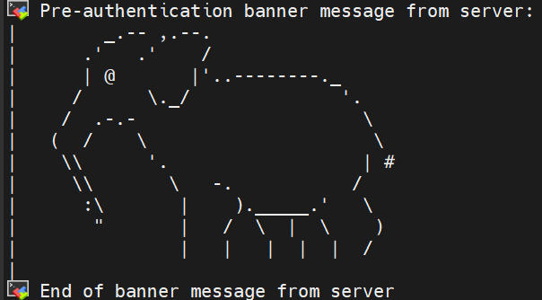

## 准备

首先, 需要准备一台主机安装Linux, 我使用的Linux发行版是Ubuntu最新的:

- [Ubuntu 24.04.1 LTS (Noble Numbat)](https://releases.ubuntu.com/noble/)
- 也适用于 [Debian 12.0](https://www.debian.org/)

当然, Debian 或者其他发行版也类似, Windows用户在WSL 2里操作也基本一致。

## 配置

### 配置net-tools

先打开terminal查看IP地址

```bash
ifconfig
```

```bash
# 打印示例
inet 192.168.11.11  netmask 255.255.240.0  broadcast 192.168.11.11
        inet6 fe80::abc:defff:f123:4567  prefixlen 64  scopeid 0x20<link>
```

如果报错, 需要先安装

```bash
 sudo apt install net-tools
```


Tips: `apt`和 `apt-get`都可以用, 两者用法也基本一致, 但从版本上来讲, 在**Debian 8**之后的版本(以及基于Debian的发行版, 例如**Ubuntu**), `apt`基本可以平替 `apt-get`


### 安装SSH

Ubuntu默认安装了SSH Client, 但是没有安装server, 直接执行:

```bash
sudo apt install openssh-server
```

```bash
sudo service ssh start
```

设置开机自启ssh服务

```
sudo systemctl enable ssh
```

可以更改 `/etc/ssh/sshd_config` 来配置SSH的执行默认启动方式, 有兴趣可以输入以下命令查看manual:

```
man sshd_config
```

例如, 这里我可以更改登录时显示的页面, 在 `/etc/ssh/sshd_config` 中添加一行:

```
Banner /etc/ssh/example.net
```

在example.net中输入你想要显示的标语, 例如:

```
# example.net
       _.-- ,.--.
     .'   .'    /
     | @       |'..--------._
    /      \._/              '.
   /  .-.-                     \
  (  /    \                     \
   \\      '.                  | #
    \\       \   -.           /
     :\       |    )._____.'   \
      "       |   /  \  |  \    )
              |   |   |  |  |  /
```

修改完后, 可以先看看配置是否有错误:

```
sudo sshd -t -f /etc/ssh/sshd_config
```

没有问题的话, 我们就可以启动了

`sudo /etc/init.d/ssh start`

或者, 如果启动过了, 可以执行restart

`sudo service ssh restart`

现在, 你就可以使用 `ssh user@ip` 的方式远程登录了, 我这里用的是 `MobaXterm`



#### 免密登录

我们通过将主机的公钥上传到服务器来实现免密码登录

首先在本地生成key

`ssh-keygen -t rsa`

命令会生成两个文件:  `~/.ssh/id_rsa` 和 `~/.ssh/id_rsa.pub`

`.pub`为公钥, 打开能看到一串字符, 复制下来一会要用到。另一个是私钥, 属于是自己偷偷保管, 别人拿走就非常危险了。公/私钥这套机制在很多地方都会用到, 诸如登录/验证/软件防盗版等等, 非常有趣且有用的算法机制, 这里暂且按下不表。

生成的公钥要传到服务器上, 那么怎么传呢?

一种比较原始的办法就是, 手动将公钥内容发送到服务器的 `authorized_keys` 的文件中, 类似这样:

`$ cat ~/.ssh/id_rsa.pub | ssh user@remote-host 'cat >> ~/.ssh/authorized_keys'`

当然也可以使用这个命令

`ssh-copy-id -i ~/.ssh/id_rsa.pub user@remote-host`

#### root用户登录

为了安全起见，众多的 `FreeBSD`默认情况下是不允许 `root`用户进行SSH远程登录的，需要进行以下操作才可以进行Root用户的ssh远程登录。

首先vi编辑 `/etc/ssh/sshd_config` , 修改以下值:

```bash
PermitRootLogin yes #允许root登录
PermitEmptyPasswords no #不允许空密码登录
PasswordAuthentication yes # 设置是否使用口令验证
```

配置完成后, 重新激活sshd服务即可

```
sudo systemctl reload ssh
```

#### IPV6登录

如果我的远程服务器和我的设备不在同一网段, 那么我们可以使用IPV6来进行登录, 可以参考我的另一篇博客: [使用IPV6登录SSH]( "IPV6")

#### 优化网络

用途不多说, 优化网络连接github方便些

`wget`获取这两个包, 这里用的是 `amd64`, 不知道自己的CPU是什么架构的, 可以通过 `uname -a `或者 `arch`命令查看

`wget https://github.com/Dreamacro/clash/releases/download/v1.11.12/clash-linux-amd64-v1.11.12.gz`

`wget https://github.com/haishanh/yacd/releases/download/v0.3.8/yacd.tar.xz`

~~`或git clone https://github.com/Elegycloud/clash-for-linux-backup.git clash-for-linux`~~

修改.env, 添加自己的订阅链接

键入命令配置 `proxy`

```
export https_proxy=http://127.0.0.1:7890 http_proxy=http://127.0.0.1:7890 all_proxy=socks5://127.0.0.1:7890
```

或source这个脚本修改:

```
source /etc/profile.d/clash.sh
```

设置开机自启动

在`/etc/systemd/system`目录新建一个文件:

```
vim /etc/systemd/system/clash@.service
```

并添加一些内容:

```
[Unit]
Description=A rule based proxy in Go for %i.
After=network.target[Service]
Type=simple
User=%i
Restart=on-abort
ExecStart=/usr/local/clash-for-linux/start.sh[Install]
WantedBy=multi-user.target
```

执行以下命令设置开机启动, `user`为当前用户名:

```
systemctl daemon-reload
systemctl enable clash@user
systemctl start clash@user
systemctl status clash@user
```

#### 安装rime

rime有两个版本, 一个是基于 `ibus`的, 一个是 `fcitx5`的, 这里使用前者。

```
sudo apt install ibus-rime
```


#### 其他工具

安装一些其他工具, 以优化Ubuntu/Debian

```bash
apt update
apt -y install net-tools curl vim zip unzip yum supervisor wget nano gnupg gnupg2 gnupg1
apt -y install sudo
apt install libcap2-bin
```

### docker安装
