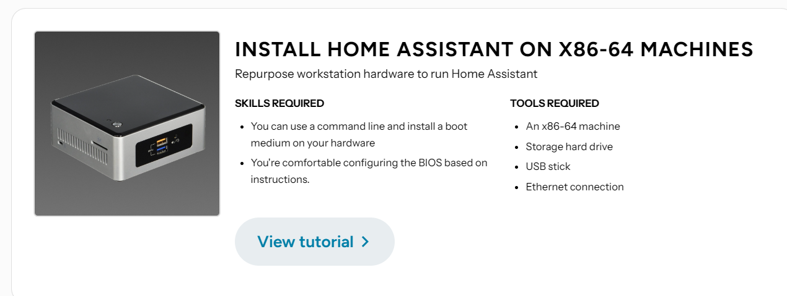

## Xiaomi Home Assistant是什么

这是一个开源项目, 本质上是一个家庭 `IoT`设备的集成工具。实际上, 小米这个开源这个项目是基于另一个开源项目Home Assistant的二次开发。大家可以在Github里找到这两个开源项目: Xiaomi [HS Xiaomi Home](https://github.com/XiaoMi/ha_xiaomi_home)和 [Home Assistant](https://github.com/home-assistant)


这个项目可谓得到广大 `NAS`和 `IoT智能设备`爱好者的追捧, githug上热度很高。当然这也是大势所趋, 现在很多电器都会带Wifi模块, 每个厂家的设备都给你开发一个APP, 最可恶的是, 每个厂家都对自己那点破数据敝帚自珍, 生怕让你知道控制设备发的什么命令。

小米这一开源举动, 真的可谓是秦王扫六合的壮举, 至少将米家的所有智能设备控制接口都整合起来, 实乃广大爱折腾人士的福音。

## 如何使用

### 准备步骤

前面说过小米的开源项目基于Home Assistant, 那么首先需要安装这个软件。可以点击[这里](https://www.home-assistant.io/installation/)安装

> Home Assistant 版本要求：
>
> - Core $\geq$ 2024.4.4
> - Operating System $\geq$ 13.0

选择你需要安装的主体, 可以选择 `树莓派`, `手机`, 或者 `电脑`

我这里在电脑上安装, 选择这个



然后,

#### 方法1

你可以选择在电脑上安装一个操作系统: `HAOS`

那么, 装在虚拟机里行不行? 应该是可以的, 但是虚拟机要获取Hardware的访问权限, 一般VMware或者Hyper-V都是可以的, 这里我们选择直接刷机,

需要改UBOOT的设置, 这里就不介绍了。

装好之后可以看到是一个类似Ubuntu的系统, 按照步骤来即可。

#### 方法2

可以在现有系统上例如Ubuntu来通过Docker容器部署

### 安装米家集成

接下来, 要基于 `HA` 进行定制, 接下来就是 `git`的基本操作了, 直接使用 `clone`下来安装

```bash
cd config
git clone https://github.com/XiaoMi/ha_xiaomi_home.git
cd ha_xiaomi_home
./install.sh /config
```

目前已经有很多个版本了, `checkout`到对应的版本

例如，更新米家集成版本至 v1.0.0

```bash
cd config/ha_xiaomi_home
git checkout v1.0.0
./install.sh /config
```

### 配置

此部分按照官方的操作, 配置完就可以愉快的控制米家设备啦

#### 登录

[设置 &gt; 设备与服务 &gt; 添加集成](https://my.home-assistant.io/redirect/brand/?brand=xiaomi_home) > 搜索“`Xiaomi Home`” > 下一步 > 请点击此处进行登录 > 使用小米账号登录

[](https://my.home-assistant.io/redirect/config_flow_start/?domain=xiaomi_home)

#### 添加 MIoT 设备

登录成功后，会弹出会话框“选择家庭与设备”。您可以选择需要添加的米家家庭，该家庭内的所有设备将导入 Home Assistant 。

#### 多账号登录

用一个小米账号登录并配置完成后，您可以在 Xiaomi Home Integration 页面中继续添加其他小米账号。

方法：[设置 &gt; 设备与服务 &gt; 已配置 &gt; Xiaomi Home](https://my.home-assistant.io/redirect/integration/?domain=xiaomi_home) > 添加中枢 > 下一步 > 请点击此处进行登录 > 使用小米账号登录

[](https://my.home-assistant.io/redirect/integration/?domain=xiaomi_home)

#### 修改配置项

在会话框“配置选项”中，可选择需要变更的配置项。您可以修改用户昵称或更新从米家 APP 导入的设备列表。

方法：[设置 &gt; 设备与服务 &gt; 已配置 &gt; Xiaomi Home](https://my.home-assistant.io/redirect/integration/?domain=xiaomi_home) > 配置 > 选择需要变更的配置项

#### Action 调试模式

开启该模式后，您可手动向设备发送带参数的 Action 控制指令。发送带参数的 Action 控制指令的用户入口显示为一个文本实体。

方法：[设置 &gt; 设备与服务 &gt; 已配置 &gt; Xiaomi Home](https://my.home-assistant.io/redirect/integration/?domain=xiaomi_home) > 配置 > Action 调试模式
