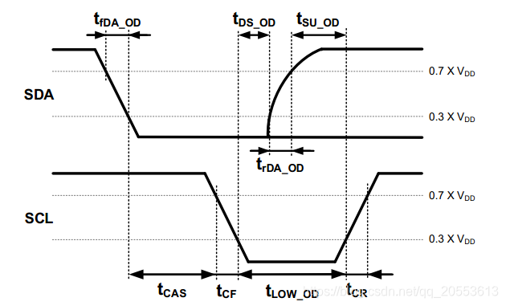
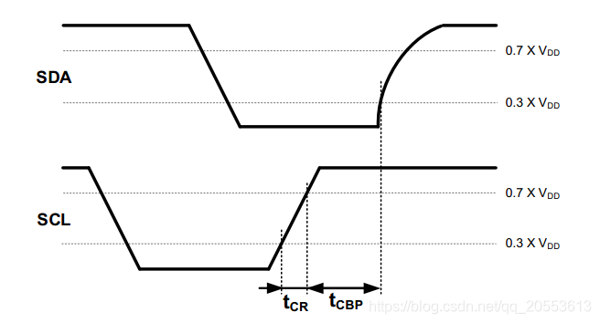

作为最常用和基本的两种串口协议, I2C和 UART我们并不陌生。但我们正的理解他们的深层次含义和设计理念吗?

I2C

I2C 一般用在EEPROM, 各类sensor上。他还有一个兄弟 I3C , I2C (**Inter-Integrated Circuit**) 和 I3C (**Improved Inter-Integrated Circuit**) 非常相似, I3C是MIPI联盟推出的, 基本上是兼容I2C的, 主要用在移动设备上用来控制传感器。I3C有很多高级功能, 包括多个master, 软中断, 动态地址等, 这里我们先不谈。

I2C是一种同步的通信协议, master提供时钟信号SCL, 这里I2C采用了一种特殊的起始和停止检测方法, 类似于曼彻斯特编码(Manchester), 即:

**起始时序**: 当SCL线为高电平是，SDA线由高电平到低电平变化。

**停止信号**: 当SCL线为高电平是，SDA线由低电平到高电平变化。

在数据传输阶段, I2C和一般的flip-flop时序电路类似。在进行数据传输时，SCL线为高电平时SDA线电平保持稳定，低电平表示数据0，高电平表示数据1；在SCL线为低电平时允许SDA线电平变化。

这里有个疑问:

为什么起始位和停止位要按曼彻斯特编码的方式来判断, 信号传输确按照FF的来设计呢?

其实很简单, I2C是一种古老的通信协议, 所使用的slave设备一般是廉价, 低速的
